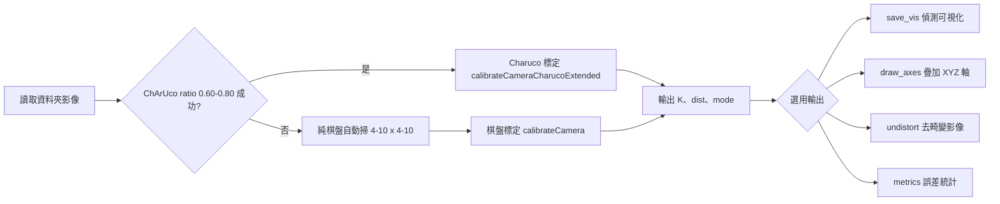

# Self-Cal (ChArUco / 棋盤) — 自動相機內參標定工具

只需一個資料夾的多張照片、**不需知道實際尺寸**，自動求取相機內參 **K** 與畸變參數 **dist**。  
流程：**優先嘗試 ChArUco（掃描 marker:chessboard ratio）→ 若失敗則改用純棋盤並自動掃描內角點數**。  
支援偵測可視化、去畸變與逐張重投影誤差統計。

---

## 特色

- **免尺寸自校正**：以單位方格（square=1）進行標定，不需量測實體棋盤尺寸。
- **雙模型自動切換**：ChArUco（掃 ratio）→ 失敗再嘗試純棋盤（自動掃 corners_x/y）。
- **豐富輸出**：`camera_calibration_selfcal.npz`、偵測疊圖、去畸變圖、逐張 RMSE CSV 與圖表。
- **可視化選項**：偵測標記、Charuco 角點、XYZ 軸疊加、去畸變預覽、RMSE 長條圖/直方圖。

---

## 安裝需求

- Python 3.8+
- 套件
  - `opencv-contrib-python`（必須，含 `cv2.aruco`）
  - `numpy`
  - `matplotlib`（選用，用於輸出 RMSE 圖）
- 建議關閉 OpenCL（已於程式內處理）以避免雜訊快取影響：
  ```python
  cv2.ocl.setUseOpenCL(False)
  ```

安裝範例：
```bash
pip install numpy opencv-contrib-python matplotlib
```

---

## 快速開始

```bash
python selfcal_auto_folder.py   --dir "C:/path/to/images"   --dict DICT_6X6_50   --save_vis --draw_axes --undistort --metrics
```

執行完成後將在影像資料夾產生：
- `camera_calibration_selfcal.npz`：內含 `K`, `dist`, `img_w`, `img_h`, `mode`
- `_vis/`：偵測疊圖、XYZ 軸疊圖、去畸變影像與誤差圖表/CSV（依選項產出）

---

## 指令與參數

| 參數 | 說明 | 預設 |
|---|---|---|
| `--dir` | 影像資料夾（必填） | — |
| `--dict` | ChArUco 所用 ArUco 字典（如 `DICT_4X4_50`, `DICT_5X5_100`, `DICT_6X6_50`…） | `DICT_4X4_50` |
| `--charuco_corners_x` | ChArUco 內角點（X/列） | `4` |
| `--charuco_corners_y` | ChArUco 內角點（Y/行） | `6` |
| `--save_vis` | 輸出偵測可視化疊圖 | `False` |
| `--draw_axes` | 疊加每張影像的 XYZ 軸（相對尺度） | `False` |
| `--axis_len` | XYZ 軸長度（單位以 square=1） | `0.5` |
| `--undistort` | 輸出去畸變影像 | `False` |
| `--metrics` | 輸出逐張 RMSE CSV 與圖表 | `False` |
| `--max_vis` | 可視化輸出上限張數 | `50` |
| `--out` | 內參輸出檔名（npz） | `camera_calibration_selfcal.npz` |

---

## 內部工作流程



---

## 輸出說明

- **`camera_calibration_selfcal.npz`**  
  - `K`：3×3 內參矩陣  
  - `dist`：畸變係數（OpenCV 格式）  
  - `img_w`, `img_h`：影像尺寸  
  - `mode`：`"charuco"` 或 `"chessboard"`
- **`_vis/` 目錄（視選項產出）**
  - `*_charuco_rXX.png`：Aruco/Charuco 偵測疊圖
  - `*_cb_CxCy.png`：棋盤偵測疊圖
  - `*_axes.png`：XYZ 軸疊圖
  - `undist_*.png`：去畸變影像
  - `selfcal_metrics.csv`：逐張 RMSE 統計
  - `reproj_per_view.png`、`reproj_hist.png`：RMSE 圖表

讀取 `npz` 範例：
```python
import numpy as np
d = np.load("camera_calibration_selfcal.npz")
K, dist = d["K"], d["dist"]
img_w, img_h, mode = int(d["img_w"]), int(d["img_h"]), str(d["mode"])
print(K, dist.ravel(), img_w, img_h, mode)
```

---

## 影像拍攝建議（提升成功率）

- 視角多元、距離與角度多變、覆蓋整個視場。
- 勿過曝/過暗，避免動態模糊與壓縮雜訊。
- **ChArUco**：確保 Marker 清晰、不要離太遠；嘗試合適的字典（如 `DICT_6X6_50`）。
- **棋盤**：內角點對比清楚；避免反光或透視變形過度集中於單一角度。
- 張數建議 ≥ 10–20（越多角度越好）。

---

## ChArUco vs 純棋盤（差異與選擇）

| 項目 | ChArUco | 純棋盤 |
|---|---|---|
| 對光照/遮擋 | **較強**：Marker 可獨立偵測、內插角點 | 較弱：需完整且清晰的角點格 |
| 特徵定位 | 利用 ArUco ID 與內插，定位**穩定** | 全靠角點幾何，對雜訊較敏感 |
| 失敗機制 | 本工具會自動 fallback 到棋盤 | 單一策略，若角點偵測失敗即無法標定 |
| 拍攝便利性 | 需列印 ChArUco（含 marker） | 任意規格棋盤（本工具自掃大小） |
| 推薦情境 | 光照/遮擋較複雜、追求穩健 | 單純光線、棋盤清楚、快速取像 |

> 本工具會先嘗試 **ChArUco（掃 ratio）**，若全失敗才自動改 **純棋盤**。

---

## 指標解讀（`--metrics`）

- `selfcal_metrics.csv` 欄位：`index, image, n_points, rmse_px`
- **RMSE（像素）愈小愈好**。通常 0.3–0.7 px 屬合理範圍（依成像/壓縮/光照而異）。
- 觀察：
  - **`reproj_per_view.png`**：找出誤差偏大的影像（可能模糊、曝光差、角度極端）。
  - **`reproj_hist.png`**：整體分布是否集中在低值。

---

## 常見問題（FAQ）

- **沒有產生 `npz`？**  
  影像未成功偵測到有效圖案。請增加張數與角度、提升對比、換更清晰的圖案，或改用另一種目標（Charuco ↔ 棋盤）。
- **ChArUco 總是失敗？**  
  嘗試更適合的 `--dict`（如 `DICT_6X6_50`），並確保 Marker 清晰且占畫面足夠比例。本工具會自動 fallback。
- **RMSE 偏大？**  
  移除模糊/過曝影像、補拍更多角度；檢查是否存在嚴重滾動快門或壓縮雜訊。
- **去畸變效果不佳？**  
  增加視角多樣性與覆蓋率；確保棋盤/Charuco 分布在視場各區域而非只在中心。

---

## 範例

1) **純可視化與去畸變**  
```bash
python selfcal_auto_folder.py --dir "./imgs" --save_vis --undistort
```

2) **變更 ChArUco 字典與內角點數**  
```bash
python selfcal_auto_folder.py --dir "./imgs" --dict DICT_6X6_50   --charuco_corners_x 5 --charuco_corners_y 7 --save_vis --metrics
```

3) **限制可視化輸出數量**  
```bash
python selfcal_auto_folder.py --dir "./imgs" --save_vis --max_vis 20
```

---

## 專案結構（執行後範例）

```
your_images/
├─ 0001.jpg
├─ 0002.jpg
├─ ...
├─ camera_calibration_selfcal.npz
└─ _vis/
   ├─ 0001_charuco_r0.70.png
   ├─ 0002_cb_9x6.png
   ├─ 0003_axes.png
   ├─ undist_0001.jpg
   ├─ selfcal_metrics.csv
   ├─ reproj_per_view.png
   └─ reproj_hist.png
```

---

## 授權

- 依您專案政策填寫（例如 MIT / Apache-2.0 等）。

---

## 版次說明

- 支援 OpenCV 舊/新 API（`ArucoDetector`、`CharucoBoard_create` 等皆已相容處理）。
- 關閉 OpenCL 快取以避免雜訊影響：`cv2.ocl.setUseOpenCL(False)`（程式已包含）。
